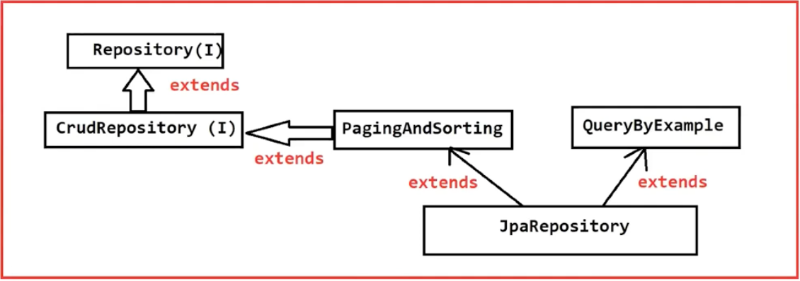
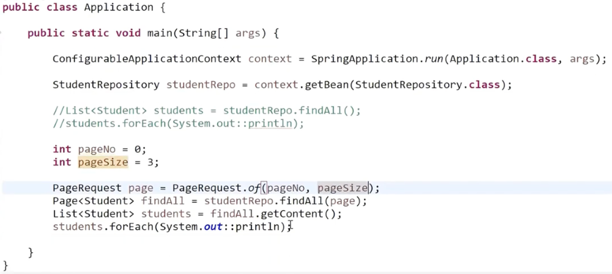
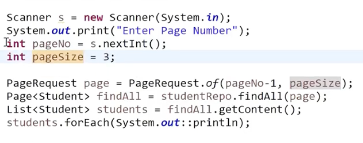

# Spring Boot
- Spring Boot is one approach to develop Spring Based Application with less configurations.
    - Spring Boot = Spring Framework - Xml Configuration
- Spring Boot is not replacement for Spring Framework. It is developed on top of Spring Framework   

### NOTE - All Spring Framework concepts can be used in Spring boot also

## Advantages -
1) Less Configuration 
    - No need to write XML files, no need to start IOC container all will be done automatically
2) Pom Starters
    - ex: web-starter, jpa-starter[database], security-starter, mail-starter
3) Auto Configuration    
4) Embedded Servers
    - ex: Tomcat(default), Jetty, Netty
5) Actuators (provides production ready features)

### NOTE - The latest stable version of Spring Boot is 4.1.x (specifically 4.1.0), which requires Java 17 as a minimum version and supports up to Java 26.

## Spring Boot Application Creation
- We can create Boot Aplication in 2 ways 
            1) Intializer website(start.spring.io)
            2) Spring Starter Project in IDE
### NOTE -
- If we try to create boot application using IDE then internally IDE will communicate with Initializer Website to create the project
- Internet connection is mandatory for system to create Spring Boot Application

## Spring Boot Folder Structure
- src/main/java : To keep our source code 

        1) it has Application.java : It is the start class of Spring Boot(main class)

- src/main/resources : To keep Project configuration files

        1) application.properties/yml

- src/test/java : to keeo JUnit code(unit testing)

        1) ApplicationTest.java

- src/test/resources : Unit Testing related config files goes here
- Maven dependencies : Downloaded jars will be available   
- pom.xml : Maven Configuration file (dependencies)    

## Spring Boot Start Class
The Spring Boot Start Class is the entry point of a Spring Boot application.

```java
@SpringBootApplication
public class SpringBootAppApplication {

    public static void main(String[] args) {
        SpringApplication.run(SpringBootAppApplication.class, args);
    }
}
```
## @SpringBootApplication
Combines:
- @SpringBootConfiguration
- @EnableAutoConfiguration
- @ComponentScan

### @SpringBootConfiguration
- Marks the class as a configuration class.

### @EnableAutoConfiguration
- Automatically configures Spring Boot based on project dependencies.

### @ComponentScan
- Scans the current package and sub-packages for:
  - @Component
  - @Service
  - @Repository
  - @Controller
  - @RestController

## main() Method
- Entry point of the Java application.
- JVM starts execution here.

## SpringApplication.run()
- Spring Boot start class main() method will call SpringApplication.run() method
- It is the entry point for boot application execution
- This run() method will return reference of IOC
## Exit Code 0

If only `spring-boot-starter` is present:
- IoC Container starts.
- Beans are created.
- No web server starts.
- Application exits successfully with Exit Code 0.

## Interview Questions

### What is @SpringBootApplication?
A convenience annotation combining @SpringBootConfiguration, @EnableAutoConfiguration and @ComponentScan.

### What does SpringApplication.run() do?
Starts the Spring Boot application, creates the IoC container, performs component scanning, dependency injection, auto configuration and starts the embedded server if required.

### Best Practices
- Keep the main class in the root package.
- Use @SpringBootApplication only once.
- Exit Code 0 means successful execution.

## Quick Revision

- Main Class = Entry Point
- @SpringBootApplication = 3 annotations combined
- SpringApplication.run() starts Spring Boot
- Main class should be in the root package
- Exit Code 0 = Success


### NOTE - SpringApplication is a predefined class and it will identify what type of application we have created based on dependencies added in pom.xml file.

        1) standalone application when (spring-boot-started)
            Class Name : "AnnotationConfigAppliationContext"[spring-boot used this class to start the IOC container]
        2) Web application when (spring-boot-starter-web)
            Class Name : "AnnotationConfigServletWebServerAppliationContext"
            [spring-boot used this class to start the IOC container]
        3) Reactive application when (spring-boot-starter-webflux)
           Class Name : "AnnotationConfigReactivetWebServerAppliationContext"
            [spring-boot used this class to start the IOC container]

- Based on type of application , It will start IOC container.   
- If we add all 3 starter the Web application starter will have the highest priority    
- run() method will print banner on the console(i.e --> Spring-logo) 
- run() method will start IOC container
- run() method will call runners
### runner is used to run any code only one time when the boot application started
- run() method will return the reference/context of IOC container  
- return type of run() method is ConfigurableApplicationContext

```java
SpringApplication.run(SpringBootAppApplication.class, args);
```

Responsibilities:
- Creates ApplicationContext (IoC Container)
- Scans components
- Creates Beans
- Performs Dependency Injection
- Applies Auto Configuration
- Starts embedded Tomcat (if spring-boot-starter-web is present)

## Q) What is Banner in Spring Boot?
- When we run boot application, it will print spring logo on the console that is called as Banner
- Spring boot banner has 3 modes

        1) Off
        2) Log
        3) Console(default)

- We can set banner mode using below property  

        spring.main.banner-mode = off [to turn it off]

- we can customize the banner txt in Spring boot application by creating "banner.txt" file in src/main/resource folder  

## Runners in Spring boot
- When you click Run, the following happens:

        JVM Starts
            ↓
        Spring Boot Starts
            ↓
        IoC Container Created
            ↓
        Beans Created
            ↓
        Dependency Injection
            ↓
        Application Ready

- runners are used to execute the logic only once when application got started
- SpringApplication.run() method will call runners
- in Spring boot we have 2 types

        1) ApplicationRunner()
        2) CommandLineRunner()

- We have to implement ApplicationRunner or CommandLineRunner Interface and whenever we implement an interface we have to @Override all the methods in it   

## What are Runners?

Runners are special interfaces provided by Spring Boot that allow you to execute code **immediately after the Spring Boot application has started successfully**.

They are mainly used for startup tasks such as:
- Loading initial data into the database
- Checking database connectivity
- Initializing cache
- Reading configuration files
- Printing startup information
- Calling external APIs during startup

## CommandLineRunner

`CommandLineRunner` is a Spring Boot interface whose `run()` method executes automatically after the application starts.

### Syntax

```java
import org.springframework.boot.CommandLineRunner;
import org.springframework.stereotype.Component;

@Component
public class MyRunner implements CommandLineRunner {

    @Override
    public void run(String... args) throws Exception {
        System.out.println("Application Started Successfully");
    }
}
```

## Explanation

### `@Component`

Registers this class as a Spring Bean.

### `implements CommandLineRunner`

Tells Spring Boot that this class should execute after startup.

### `run(String... args)`

This method is automatically called once the application is ready.

The parameter

```java
String... args
```

contains all command-line arguments.

Example

```bash
java -jar app.jar Suraj Java Spring
```

Then

```java
args[0] = "Suraj"
args[1] = "Java"
args[2] = "Spring"
```

## Advantages

- Very easy to use
- Suitable for simple startup logic
- Good for beginners

## Real Project Uses
- Loading data from DB to cache memory
- Insert default admin user
- Load sample data
- Print startup logs
- Check database connection

## ApplicationRunner

`ApplicationRunner` is another Spring Boot interface that executes after startup.

Instead of receiving raw strings, it receives an `ApplicationArguments` object.

### Syntax

```java
import org.springframework.boot.ApplicationArguments;
import org.springframework.boot.ApplicationRunner;
import org.springframework.stereotype.Component;

@Component
public class MyRunner implements ApplicationRunner {

    @Override
    public void run(ApplicationArguments args) throws Exception {

        System.out.println("Application Started Successfully");

    }
}
```

## What is ApplicationArguments?

Spring wraps the command-line arguments into an object.

This object provides useful methods like:

```java
args.containsOption("name");
args.getOptionValues("name");
args.getNonOptionArgs();
```

Example

Run application as:

```bash
java -jar app.jar --name=Suraj --city=Delhi Java
```

Now,

```java
args.containsOption("name");
```

returns

```text
true
```

and

```java
args.getOptionValues("name");
```

returns

```text
[Suraj]
```

## Difference Between CommandLineRunner and ApplicationRunner

| Feature | CommandLineRunner | ApplicationRunner |
|----------|-------------------|-------------------|
| Interface | CommandLineRunner | ApplicationRunner |
| Method | `run(String... args)` | `run(ApplicationArguments args)` |
| Arguments | Raw String Array | Parsed Arguments Object |
| Complexity | Simple | More Flexible |
| Best For | Simple startup tasks | Complex command-line argument handling |

## Which One Should You Use?

### Use CommandLineRunner when:

- Startup task is simple
- No advanced command-line argument parsing is needed
- You just want to execute startup logic


### Use ApplicationRunner when:

- You need command-line options
- You want parsed arguments
- Your application has multiple startup parameters


## Multiple Runners

If multiple runners exist,

Spring can execute them in a specific order using `@Order`.

Example

```java
@Component
@Order(1)
public class FirstRunner implements CommandLineRunner {

    @Override
    public void run(String... args) {

        System.out.println("First Runner");

    }
}
```

```java
@Component
@Order(2)
public class SecondRunner implements CommandLineRunner {

    @Override
    public void run(String... args) {

        System.out.println("Second Runner");

    }
}
```

Output

```text
First Runner
Second Runner
```

## Internal Working

```text
Run Application
      ↓
SpringApplication.run()
      ↓
ApplicationContext Created
      ↓
Beans Created
      ↓
Dependency Injection
      ↓
Auto Configuration
      ↓
Application Ready
      ↓
Runner Executes
```

---

## Real-Life Example

Suppose you are building an E-Commerce application.

Whenever the application starts, you want to

- Create Admin User
- Insert Default Categories
- Load Products
- Verify Database Connection

Instead of writing this inside `main()`, you use a Runner.

## Advantages of Runners

- Automatic execution after startup
- Keeps startup logic separate
- Easy initialization
- Useful in real-world applications


## Q1. What is CommandLineRunner?

A Spring Boot interface that executes the `run(String... args)` method automatically after the application starts.

## Q2. What is ApplicationRunner?

A Spring Boot interface that executes the `run(ApplicationArguments args)` method after startup and provides structured access to command-line arguments.

## Q3. What is the difference?

**CommandLineRunner**
- Receives raw String arguments

**ApplicationRunner**
- Receives parsed `ApplicationArguments`

## Q4. When do Runners execute?

After

- IoC Container is created
- Bean creation
- Dependency Injection
- Auto Configuration
- Application Startup

## Q5. Can we have multiple runners?

Yes.

Use

```java
@Order(1)
```

to specify execution order.

## Best Practices

- Keep runner logic small.
- Do not write heavy business logic inside runners.
- Use runners only for startup initialization.
- Use `@Order` when multiple runners are present.
- Prefer `ApplicationRunner` when working with command-line options.

## One-Minute Revision

✅ Runner = Executes after Spring Boot starts.

✅ Types:
- CommandLineRunner
- ApplicationRunner

✅ CommandLineRunner

- `run(String... args)`
- Raw String arguments

✅ ApplicationRunner

- `run(ApplicationArguments args)`
- Parsed command-line arguments

✅ `@Order` controls execution order.

✅ Common Uses

- Database initialization
- Cache loading
- Startup validation
- Logging
- Reading configuration

## Interview Cheat Sheet

| Question | Answer |
|----------|--------|
| What is a Runner? | Executes code after Spring Boot startup |
| Types of Runners? | CommandLineRunner and ApplicationRunner |
| Which receives String arguments? | CommandLineRunner |
| Which receives ApplicationArguments? | ApplicationRunner |
| Which is more flexible? | ApplicationRunner |
| Annotation for execution order? | `@Order` |
| When do runners execute? | After the application is fully initialized |
| Common Uses? | Data loading, cache initialization, startup tasks |


## Easy Trick to Remember

**CommandLineRunner**

> "Give me the arguments exactly as they were typed."

**ApplicationRunner**

> "Give me the arguments in an organized and easy-to-use format."

**Summary**

- Both are startup hooks in Spring Boot.
- Both execute after the application is fully initialized.
- `CommandLineRunner` is simple and uses `String... args`.
- `ApplicationRunner` is more powerful and uses `ApplicationArguments`.
- Use runners for startup initialization tasks, not for long-running business logic.     

### NOTE - If anyone forgets to write @Autowired while performing Setter Injection there is a chance of getting Nullpointerexception and in Field Injection, it breaks the oops concept bcz it Implements SI using reflection API but in constructor Injection there is no such problem even if we dnt give @Autowired the obj will still be created if there is single constructor and if there are multiple constructor the by defauly the 0-param constructor's object will be created if we have to create some specific constructors obj then we'll have to give @Autowired to that

### NOTE - there is no use for @Autowired on Primitive data type , we should only use it for reference data type

# Difference Between @Component, @Service, and @Repository

## First, What is a Stereotype Annotation?

A **Stereotype Annotation** tells Spring:

> "This class should be managed by the Spring IoC Container."

When Spring performs **Component Scanning**, it looks for these annotations and creates beans automatically.

The most common stereotype annotations are:

- `@Component`
- `@Service`
- `@Repository`
- `@Controller`
- `@RestController`

---

# 1. @Component

## Definition

`@Component` is the **generic stereotype annotation**.

It is used for any Java class that should become a Spring Bean but doesn't belong to a specific layer.

---

## Example

```java
@Component
public class EmailUtil {

    public void sendMail() {
        System.out.println("Sending Email...");
    }

}
```

Spring creates an object of this class automatically.

---

## When to Use?

Use `@Component` for:

- Utility Classes
- Helper Classes
- Validator Classes
- Common Services
- Any class that doesn't fit into Service, Repository, or Controller

---

# 2. @Service

## Definition

`@Service` is a specialization of `@Component`.

It represents the **Business Logic Layer**.

---

## Example

```java
@Service
public class StudentService {

    public void saveStudent() {

        System.out.println("Business Logic");

    }

}
```

---

## Responsibilities

- Business Logic
- Calculations
- Validation
- Calling Repository
- Calling External APIs

---

## Why Use @Service Instead of @Component?

Both create beans.

But `@Service` clearly tells another developer:

> "This class contains business logic."

This improves readability and maintainability.

---

# 3. @Repository

## Definition

`@Repository` is also a specialization of `@Component`.

It represents the **Data Access Layer (DAO Layer).**

---

## Example

```java
@Repository
public class StudentRepository {

    public void save() {

        System.out.println("Saving Student");

    }

}
```

---

## Responsibilities

- Database Operations
- CRUD Operations
- SQL Queries
- JPA Operations
- Data Access

---

## Special Feature of @Repository

Unlike `@Component` and `@Service`,

`@Repository` provides **Exception Translation**.

Example

If JDBC throws

```text
SQLException
```

Spring converts it into

```text
DataAccessException
```

This makes exception handling easier and independent of the database technology.

---

# Internal Working

```text
@Component
       │
       ▼
Spring Creates Bean

@Service
       │
       ▼
Spring Creates Bean

@Repository
       │
       ▼
Spring Creates Bean
```

All three annotations create Spring Beans.

The difference is mainly **their intended role**.

---

# Relationship

```text
@Component
      ▲
      │
 ┌────┴────┐
 │         │
@Service  @Repository
```

Both `@Service` and `@Repository` are specialized forms of `@Component`.

---

# Layered Architecture

```text
Client
   │
   ▼
@Controller / @RestController
   │
   ▼
@Service
   │
   ▼
@Repository
   │
   ▼
Database
```

---

# Comparison Table

| Feature | @Component | @Service | @Repository |
|----------|------------|-----------|--------------|
| Bean Creation | ✅ Yes | ✅ Yes | ✅ Yes |
| Component Scanning | ✅ Yes | ✅ Yes | ✅ Yes |
| Layer | Generic | Business Layer | Data Access Layer |
| Business Logic | ❌ No | ✅ Yes | ❌ No |
| Database Logic | ❌ No | ❌ No | ✅ Yes |
| Exception Translation | ❌ No | ❌ No | ✅ Yes |
| Recommended Use | Utility/Helper Classes | Service Layer | Repository/DAO Layer |

---

# Real Project Example

```
com.example.studentmanagement

│
├── controller
│      └── StudentController
│
├── service
│      └── StudentService
│
├── repository
│      └── StudentRepository
│
├── util
│      └── EmailUtil
```

### StudentController

```java
@RestController
public class StudentController {

}
```

Handles HTTP requests.

---

### StudentService

```java
@Service
public class StudentService {

}
```

Contains business logic.

---

### StudentRepository

```java
@Repository
public class StudentRepository {

}
```

Interacts with the database.

---

### EmailUtil

```java
@Component
public class EmailUtil {

}
```

Provides utility methods.

---

# Frequently Asked Interview Questions

## Q1. What is the difference between @Component and @Service?

Technically, both create Spring Beans.

The difference is their purpose.

- `@Component` → Generic bean.
- `@Service` → Business logic layer.

---

## Q2. What is the difference between @Service and @Repository?

- `@Service` contains business logic.
- `@Repository` handles database operations and supports exception translation.

---

## Q3. Does Spring create beans for all three?

Yes.

All three annotations register the class as a Spring Bean during component scanning.

---

## Q4. Which annotation provides Exception Translation?

`@Repository`

It converts database-specific exceptions into Spring's `DataAccessException`.

---

## Q5. Can I use @Component instead of @Service?

Yes, technically it will work because `@Service` is a specialization of `@Component`.

However, it is **not recommended** because `@Service` makes the code more readable and clearly indicates that the class contains business logic.

---

# Best Practices

- Use `@Component` for generic helper or utility classes.
- Use `@Service` for business logic classes.
- Use `@Repository` for data access classes.
- Follow the layered architecture for clean, maintainable code.

---

# One-Minute Revision

- `@Component` = Generic Spring Bean.
- `@Service` = Business Logic Layer.
- `@Repository` = Database Layer.
- All three are discovered by **Component Scanning**.
- All three create Spring Beans.
- `@Repository` provides **Exception Translation**.
- `@Service` and `@Repository` are specialized forms of `@Component`.

---

# Easy Trick to Remember

🏠 **Think of an Online Shopping Application**

- 🛠 **@Component** → Helper (Email Utility, PDF Generator, File Utility)
- 🧠 **@Service** → Manager who decides the business rules (discounts, order validation, payment flow)
- 🗄 **@Repository** → Clerk who stores and retrieves data from the database

# application.properties vs application.yml (Spring Boot)

## What are these files?

Both **application.properties** and **application.yml** are configuration files used by Spring Boot.

They store configuration such as:

- Server Port
- Database Configuration
- Logging Configuration
- Application Name
- Security Configuration
- Custom Properties

Spring Boot automatically loads either of these files from:

```
src/main/resources
```

> **Interview Point:** Spring Boot supports both formats. You can use either one depending on your project's preference.

---

# 1. application.properties

## Definition

`application.properties` stores configuration in **key=value** format.

### Example

```properties
spring.application.name=StudentManagement

server.port=8080

spring.datasource.url=jdbc:mysql://localhost:3306/studentdb

spring.datasource.username=root

spring.datasource.password=root

logging.level.root=INFO
```

---

## Advantages

- Easy for beginners
- Simple syntax
- Widely used
- Good for small projects

---

## Disadvantages

- Difficult to read when the project grows
- Repeated property names
- Long configuration files

---

# 2. application.yml

## Definition

`application.yml` (YAML) stores configuration in a **hierarchical (tree-like)** format using indentation.

### Example

```yaml
spring:
  application:
    name: StudentManagement

  datasource:
    url: jdbc:mysql://localhost:3306/studentdb
    username: root
    password: root

server:
  port: 8080

logging:
  level:
    root: INFO
```

Notice how related properties are grouped together.

---

## Advantages

- Cleaner
- Easier to read
- Better organization
- Less repetition
- Preferred in large projects

---

## Disadvantages

- Indentation is mandatory
- Beginners often make spacing mistakes

---

# Comparison

| Feature | application.properties | application.yml |
|----------|------------------------|-----------------|
| Format | key=value | Hierarchical (YAML) |
| Readability | Good for small files | Better for large files |
| Repetition | More | Less |
| Indentation | Not required | Required |
| Learning Curve | Easy | Slightly higher |
| Large Projects | Less preferred | Preferred |

---

# Example Comparison

## application.properties

```properties
student.name=Suraj
student.age=22
student.city=Bangalore
```

---

## application.yml

```yaml
student:
  name: Suraj
  age: 22
  city: Bangalore
```

Both represent the **same configuration**.

---

# Nested Configuration Example

## application.properties

```properties
spring.datasource.url=jdbc:mysql://localhost:3306/studentdb

spring.datasource.username=root

spring.datasource.password=root
```

---

## application.yml

```yaml
spring:
  datasource:
    url: jdbc:mysql://localhost:3306/studentdb
    username: root
    password: root
```

The YAML version is easier to read because related properties are grouped.

---

# Lists Example

## application.properties

```properties
student.subjects[0]=Java
student.subjects[1]=Spring
student.subjects[2]=MySQL
```

---

## application.yml

```yaml
student:
  subjects:
    - Java
    - Spring
    - MySQL
```

YAML is much cleaner for lists.

---

# Map Example

## application.properties

```properties
student.marks.java=90
student.marks.spring=95
student.marks.mysql=88
```

---

## application.yml

```yaml
student:
  marks:
    java: 90
    spring: 95
    mysql: 88
```

---

# How Does Spring Boot Read Them?

When the application starts:

```text
Application Starts
        ↓
Spring Boot Looks in
src/main/resources
        ↓
Finds application.properties
or application.yml
        ↓
Loads Configuration
        ↓
Makes Values Available
        ↓
@Value / @ConfigurationProperties
```

---

# Can We Use Both Together?

Yes.

Spring Boot can load both files.

However,

**Best Practice:** Use only **one format** in a project to keep configuration consistent.

---

# Which One Should You Use?

### Small Projects

Use

```
application.properties
```

because it is simple.

---

### Large Projects

Use

```
application.yml
```

because it is more organized and easier to maintain.

---

# Interview Questions

## Q1. What is the difference between application.properties and application.yml?

Both are configuration files used by Spring Boot.

- `application.properties` uses **key=value** format.
- `application.yml` uses **YAML (hierarchical)** format.

---

## Q2. Which one is better?

For small projects:

- `application.properties`

For medium and large projects:

- `application.yml`

because it is cleaner and easier to maintain.

---

## Q3. Can Spring Boot read both?

Yes.

Spring Boot supports both formats.

---

## Q4. Where are these files located?

```
src/main/resources
```

---

## Q5. Which file is preferred in modern Spring Boot projects?

Many modern Spring Boot projects use **application.yml** because of its readability, especially when there are many nested properties. However, **application.properties** is still fully supported and widely used.

---

# Best Practices

- Keep configuration outside Java code.
- Use meaningful property names.
- Do not hardcode passwords or API keys.
- Use environment variables or secret management for sensitive values.
- Use one configuration format consistently throughout a project.

---

# One-Minute Revision

- Both files configure Spring Boot applications.
- Location:

```
src/main/resources
```

- `application.properties` → key=value
- `application.yml` → hierarchical YAML
- YAML is cleaner for nested objects, lists, and maps.
- Both support the same configuration options.
- Spring Boot automatically loads them at startup.

---

# Easy Trick to Remember

### application.properties

Think of it as a **flat notebook**:

```text
Name = Suraj
Age = 22
City = Bangalore
```

Everything is written one line at a time.

---

### application.yml

Think of it as a **family tree**:

```text
Student
   ├── Name
   ├── Age
   └── City
```

Related information stays together, making it easier to read.

---

# Interview Cheat Sheet

| Question | Answer |
|----------|--------|
| Purpose of both files? | Store Spring Boot configuration |
| Location? | `src/main/resources` |
| Properties format? | `key=value` |
| YAML format? | Hierarchical with indentation |
| Better for small projects? | `application.properties` |
| Better for large projects? | `application.yml` |
| Can Spring Boot read both? | Yes |
| Recommended practice? | Use one format consistently in a project |

- properties file can be converted to yml file but vice-versa is not possible
- it is recommended to use .yml file instead of .properties file

# Spring Data JPA
- Application contains several layers
        1) Presentation layer(JSP / Thcmeleaf / Angular / React JS / Vue JS)
        2) Web layer (Servlets / Struts / Spring Web MVC)
        3) Persistence layer (JDBC / Spring JDBC / Spring ORM / Spring Data JPA)
- Spring Data JPA is used to develop persistence layer 
- Spring DAta JPA Provides ready made methods to perform CRUD operations in DB tables   

        1) CrudRepository (Interface)
        2) JpaRepository (Interface)

### NOTE : JpaRepository = CrudRepository + Pagination Methods + Sorting Methods

## Spring Data JPA Terminology
1) Data Source Object - It Represents databse conncetions. Data Source Properties we can configure in application.properties or application.yml

2) Entity Class - the class which is mapped to Database table 

        - @Entity - to represent a class as entity class
        - @Table(name="asfjaj") - to map it to a table [if we dont write @Table annotation java will take the class name as the table name by Default]
        - @Id - to represent it as a primary key
        - @Column(name = "STUDENT_ID") - to make it as a column
        
3) Repository Interface - For every table we will create repository interface to perform CRUD operation

        public interface StudentRepository extenda CrudRepository<Entity, ID>{

        }

        NOTE - by using StudentRepository we can perform CRUD operation in STUDENT_TABLE

        NOTE - for our repository interface the implementation will be provided in the runtime using Proxy Class [just create and extend that's all]

4) Repository methods - Ready made methods provided by Data JPA to perform CRUD operations  

        a) save - take Entity object as parameter [used to insert single record]
        b) saveall - (Iterable<Entity> i) - multiple records at a time
        
        NOTE - Above two methods are called as "UPSERT"[Update & Insert] methods.

        c) findById(ID id) - to retrieve data using ID
        d) findAllById(Iterable<ID> ids) - to retrieve multiple records based on the primary keys
        e) findAll() - to retrieve all the records available
        f) count() - count of record
        g) existById(ID id) - if exist true or else false
        h) deleteById(ID id) - delete records
        i) deleteAllById(ID id) - to delete multiple records
        j) deleteAll() - to delete all the records

5) ORM Properties - to automate some configuration

        a) auto_ddl - Dynamic schema generation [if tables are not there it should be created]
                jpa:
                  hibernate:
                    ddl-auto: update
        b) show_sql - display generated queries on the console
                  show-sql: true

## First Application Development Using Spring Data JPA
1) Create Spring Starter project with below dependencies

        a) springboot-starter-data-jpa
        b) mysql-connector   

2) Create entity class and map with DB table using annotations

3) Create Repository interface to perform CRUD operations

4) Configure Data source Properties in application.yml file

5) Run the application and test the functionality

### NOTE - Default connecton pool used by the Data JPA is -> HikariPool - 1 internally

### NOTE - the java class mapped to Databse table is called ENTITY

## findBy(Col_name[Entity variable name]) Methods in Data JPA 
- by using it we can retrieve the data based on non-primary key columns
- When we write findBy(Col_name[Entity variable name]) methods, JPA will construct query based on method name
### NOTE - Method naming convention is very Important for this

        - create a abstract method with that col_name where we extend Crud_repo
            public List<Student> findByGender(String gender);  
        - in main class
            List<Student> maleStudents = studentRepo.findByGender("Male");
            maleStudents.forEach(System.out::println);

- Using this we can only perform retrievals or we can say only select operations 

## Custom Queries in Data JPA
- To execute custom queries we will use @Query annotation
- @Query will support for executing both HQL and Native SQL queries also.

        HQL: Hibernate Query Language (Database Independent Queries)
            - we will use Entity class name + Entity class variable to write Query
            - HQL Queries will converted to SQL Queries by Dialect class for execution 
            - so when we change app from one DB to another there is no need to change any Query because Dialect class will tkae care of query conversion
            - poor performamce bcz of conversion[every HQL Query should be converted to SQL quesries]
            - use when MAINTENANCE is important

        SQL : Structured Query Language (Database Dependent Queries)
            - we will use table name & column name to write the Query
            - SQL queries will directly execute in database
            - IF we change app from one DB to another DB then all queries may not execute
            - better performance than HQL
            - use when PERFORMANCE is important

        @Query(value = "select * from student_dtls" , nativeQuery = true[means it is a SQL query])
        public List<Student> getAllStudents();

        @Query("from Student")[HQL query]
        public List<Student> getStudents(); 

### Queries - 
- SQL : select * from student_dtls where student_gender = :gender
- HQL : from Student where gender = :gender

- SQL : sekect * from student_dtls where student_gender is null
- HQL : from Student where gender is null

- SQL : select * from student_dtls where student_rank >= :rank
- HQL : from Student where student_rank >= :rank

- SQL : select * from student_dtls where student_rank <= :rank
- HQL : from Student where student_rank <= :rank

- SQL : select * from student_dlts where student_gender = :gender and student_rank >= :rank
- HQL : from Student where gender = :gender and rank >= :rank

- SQL select student_rank, student_gender from student_dlts
- HQL : select rank, gender from Student


## Selection : 
- Retrieving specific rows from the table. We can achieve this by using 'where' keyword in the query
- ex: select * from student_dtls where gender = 'Male';

## Projection :
- Retrieving specific columns from the table is called as Projection. We can achieve it by using column names in query
- ex : select student_rank, student_gender from student_dlts

### NOTE : We can combine selection and projection in single query
            ex: select student_rank, student_gender from student_dlts where student_rank <= 100;

## JpaRepository      
- It is predefimned interface provided by Spring Data JPA
- JpaRepository provided several methods to perform CRUD operations with database.
- JpaRepository provided few additional methods to perform operations
        JpaRepository = CrudRepository + PagingAndSorting + QueryByExample



## Pagination 
- Displaying table records in multiple pages is called as Pagination.
- ex : Google search will display with Pagination (size : 10)
- ex : Gmail with Pagination (size : 50 mails per page)





